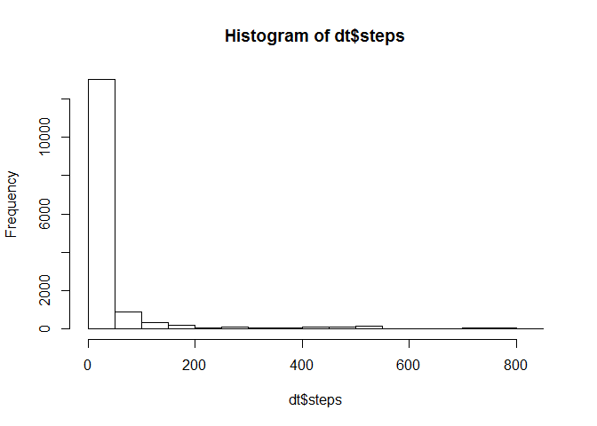
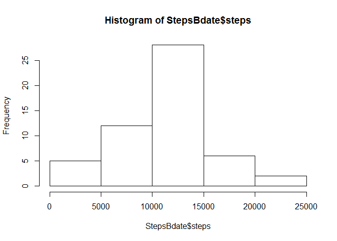
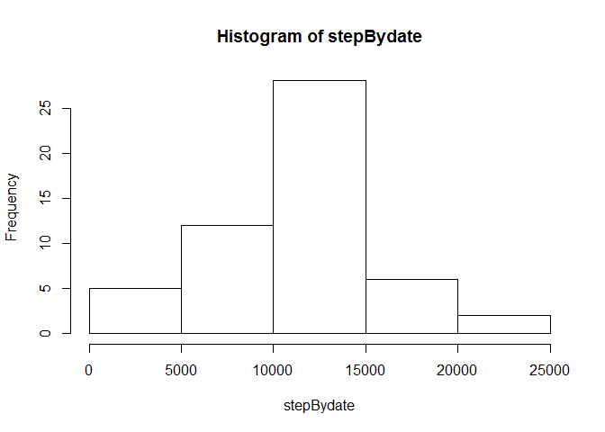
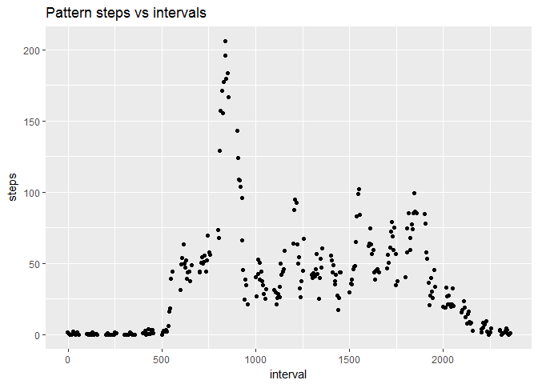
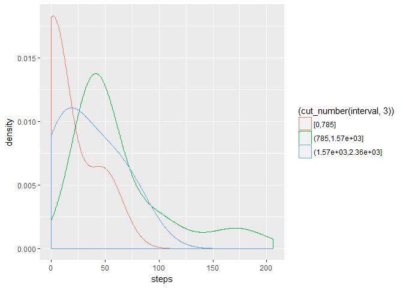
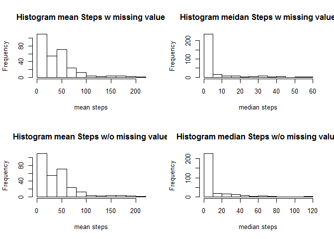

# Reproducible Research: Peer Assessment 1

***
> Introduction

*It is now possible to collect a large amount of data about personal movement using activity monitoring devices such as a Fitbit, Nike Fuelband, or Jawbone Up. These type of devices are part of the "quantified self" movement - a group of enthusiasts who take measurements about themselves regularly to improve their health, to find patterns in their behavior, or because they are tech geeks. But these data remain under-utilized both because the raw data are hard to obtain and there is a lack of statistical methods and software for processing and interpreting the data.*

*This assignment makes use of data from a personal activity monitoring device. This device collects data at 5 minute intervals through out the day. The data consists of two months of data from an anonymous individual collected during the months of October and November, 2012 and include the number of steps taken in 5 minute intervals each day.*

> Code for assignment

## Loading and preprocessing the data


```r
rm(list = ls())
#set working directory
setwd("D:/Coursera/DS/Reproducible")
getwd()
```

```
## [1] "D:/Coursera/DS/Reproducible"
```

```r
if(!file.exists("data")) {
    dir.create("data")
}
#download and unzip, file handling

fileURL<-"https://d396qusza40orc.cloudfront.net/repdata%2Fdata%2Factivity.zip"
download.file(fileURL, destfile="./data/rawdata.zip")
fileloc<-paste(getwd(),"/data/rawdata.zip",sep="")
s<-unzip(fileloc,list=F,exdir = getwd(), overwrite = T)
dt<-read.csv(paste(getwd(),"activity.csv", sep="/"))
```

### Basic exploratory 

```r
str(dt)
```

```
## 'data.frame':	17568 obs. of  3 variables:
##  $ steps   : int  NA NA NA NA NA NA NA NA NA NA ...
##  $ date    : Factor w/ 61 levels "2012-10-01","2012-10-02",..: 1 1 1 1 1 1 1 1 1 1 ...
##  $ interval: int  0 5 10 15 20 25 30 35 40 45 ...
```

```r
summary(dt)
```

```
##      steps                date          interval     
##  Min.   :  0.00   2012-10-01:  288   Min.   :   0.0  
##  1st Qu.:  0.00   2012-10-02:  288   1st Qu.: 588.8  
##  Median :  0.00   2012-10-03:  288   Median :1177.5  
##  Mean   : 37.38   2012-10-04:  288   Mean   :1177.5  
##  3rd Qu.: 12.00   2012-10-05:  288   3rd Qu.:1766.2  
##  Max.   :806.00   2012-10-06:  288   Max.   :2355.0  
##  NA's   :2304     (Other)   :15840
```

```r
### 'NA' portion in the steps variable
sum(is.na(dt$steps))/dim(dt)[1]
```

```
## [1] 0.1311475
```

```r
sum(is.na(dt$date))/dim(dt)[1]
```

```
## [1] 0
```

```r
sum(is.na(dt$interval))/dim(dt)[1]
```

```
## [1] 0
```

```r
#pairs(dt)
head(dt)
```

```
##   steps       date interval
## 1    NA 2012-10-01        0
## 2    NA 2012-10-01        5
## 3    NA 2012-10-01       10
## 4    NA 2012-10-01       15
## 5    NA 2012-10-01       20
## 6    NA 2012-10-01       25
```

```r
tail(dt)
```

```
##       steps       date interval
## 17563    NA 2012-11-30     2330
## 17564    NA 2012-11-30     2335
## 17565    NA 2012-11-30     2340
## 17566    NA 2012-11-30     2345
## 17567    NA 2012-11-30     2350
## 17568    NA 2012-11-30     2355
```

```r
hist(dt$steps)
```

<!-- -->
### Convert the data format (optional) 
Using the `aggregate()` to reorganize the results, sum by dates. 
`tapply can achieve the same results`

```r
#Aggregate to make a new dateframe
StepsBdate<-aggregate(steps~date,data=dt,sum,na.rm=TRUE)
#sum of steps by dates. 
stepBydate<-tapply(dt$steps, dt$date, sum,rm.na=TRUE)
stepBydate1<-tapply(dt$steps, dt$date, sum)
```

## What is mean total number of steps taken per day?

```r
#date conversion, not nessary for the problem, but usually useful
dt$date1<-as.Date(dt$date, format="%Y-%m-%d")

#use Aggregate data frame
hist(StepsBdate$steps)
```

<!-- -->

```r
#use tapply table
hist(stepBydate)
```

<!-- -->

```r
#if including NA
hist(stepBydate1)
```

<!-- -->

```r
#mean and median calculations
mean(StepsBdate$steps)
```

```
## [1] 10766.19
```

```r
median(StepsBdate$steps)
```

```
## [1] 10765
```

```r
#if use array from tapply
mean(stepBydate, na.rm =T)
```

```
## [1] 10767.19
```

```r
median(stepBydate, na.rm =T)
```

```
## [1] 10766
```


## What is the average daily activity pattern?
This is trying to look at the time interval dependence on steps
I use the aggregate function here as the tapply case will be similar to the demo above for dates.

```r
#Using the mean as the metric to monitor the pattern here. 
StepsByInterval<-aggregate(steps~interval, data=dt, mean, na.rm=TRUE)
StepsByInterval_m<-aggregate(steps~interval, data=dt, median, na.rm=TRUE)
library(ggplot2)
g<-ggplot(StepsByInterval, aes(interval,steps))+
  geom_jitter()+
  labs(title="Pattern steps vs intervals")
print(g)
```

<!-- -->

```r
#alternatively, look at the step density once cut the day into 3 parts
g2<-ggplot(StepsByInterval, aes(steps, colour=(cut_number(interval,3))))+
  geom_density(adjust=2)
print(g2)
```

<!-- -->

* Make a time series plot (i.e. type = "l") of the 5-minute interval (x-axis) and the average number of steps taken, averaged across all days (y-axis)

```r
plot(steps~interval,data=StepsByInterval,type="l")
```

<!-- -->

* Which 5-minute interval, on average across all the days in the dataset, contains the maximum number of steps?

```r
StepsByInterval[which.max(StepsByInterval$steps),]$interval
```

```
## [1] 835
```
The interval is 835, meaning: 8:35am.

## Imputing missing values
* Calculate and report the total number of missing values in the dataset (i.e. the total number of rows with NAs)
This is available in *Basic Exploratory* section,

```r
sum(is.na(dt$steps))
```

```
## [1] 2304
```
* Devise a strategy for filling in all of the missing values in the dataset. The strategy does not need to be sophisticated. For example, you could use the mean/median for that day, or the mean for that 5-minute interval, etc.

*used a strategy to fill the missing values with the mean for that 5-minute interval.*
The `StepsByInterval` would be the "dictionary" to fill the missing values. 

```r
#copy the existing values 
fill_dt<-dt

for (i in 1:nrow(dt)) {
  if(is.na(fill_dt$steps[i])) {
    #fill the missing values
    #find the corresponding interval and use the StepsByInterval to fill the na
    fill_dt$steps[i]<-StepsByInterval$steps[StepsByInterval$interval==dt$interval[i]]
  }
}
#this is to verify all the na are filled by mean
print(sum(is.na(fill_dt$steps)))
```

```
## [1] 0
```
We can compare the differences below, observations:
1. Mean is the same w or w/o missing value: not surprising as we replace by mean values
2. Meidan changes, this is expected as meidan are not necessarily the same as mean. It depends on the distributions. 


```r
StepsByInterval2<-aggregate(steps~interval, data=fill_dt, mean, na.rm=TRUE)
StepsByInterval2_m<-aggregate(steps~interval, data=fill_dt, median, na.rm=TRUE)
par(mfrow=c(2,2))
hist(StepsByInterval$steps, main="Histogram mean Steps w missing value", xlab="mean steps")
hist(StepsByInterval_m$steps,main="Histogram meidan Steps w missing value", xlab="median steps")
hist(StepsByInterval2$steps, main="Histogram mean Steps w/o missing value", xlab="mean steps")
hist(StepsByInterval2_m$steps, main="Histogram median Steps w/o missing value", xlab="median steps")
```

<!-- -->

## Are there differences in activity patterns between weekdays and weekends?
Here we need the `as.Date()` and `as.POSIXlt()` functions to get to see if it's weekend or weekdays. 

*Here, we use the filled values.*

* Create a new factor variable in the dataset with two levels - "weekday" and "weekend" indicating whether a given date is a weekday or weekend day.


```r
fill_dt$label<-as.POSIXlt(fill_dt$date1)$wday
unique(as.POSIXlt(fill_dt$date1)$wday)
```

```
## [1] 1 2 3 4 5 6 0
```

```r
#it shows Monday to Sunday, from 1 to 6, 0--> 6 or 0 are weekend
fill_dt$label=ifelse(as.POSIXlt(fill_dt$date1)$wday%%6==0,"weekend","weekday")
# For Sunday and Saturday : weekend, Other days : weekday 
fill_dt$label=factor(fill_dt$label,levels=c("weekday","weekend"))
summary(fill_dt)
```

```
##      steps                date          interval          date1           
##  Min.   :  0.00   2012-10-01:  288   Min.   :   0.0   Min.   :2012-10-01  
##  1st Qu.:  0.00   2012-10-02:  288   1st Qu.: 588.8   1st Qu.:2012-10-16  
##  Median :  0.00   2012-10-03:  288   Median :1177.5   Median :2012-10-31  
##  Mean   : 37.38   2012-10-04:  288   Mean   :1177.5   Mean   :2012-10-31  
##  3rd Qu.: 27.00   2012-10-05:  288   3rd Qu.:1766.2   3rd Qu.:2012-11-15  
##  Max.   :806.00   2012-10-06:  288   Max.   :2355.0   Max.   :2012-11-30  
##                   (Other)   :15840                                        
##      label      
##  weekday:12960  
##  weekend: 4608  
##                 
##                 
##                 
##                 
## 
```


* Make a panel plot containing a time series plot (i.e. type = "l") of the 5-minute interval (x-axis) and the average number of steps taken, averaged across all weekday days or weekend days (y-axis). The plot should look something like the following, which was creating using simulated data.
*Use `lattice()`library to plot.

```r
StepsByInterval3<-aggregate(data=fill_dt, steps~interval+label, mean)
library(lattice)
xyplot(steps~interval|factor(label),data=StepsByInterval3,aspect=1/2,type="l")
```

<!-- -->

*Observations*

From above chart, one can see at weekend, more steps happen during the day, as people don't need to be at work. Meanwhile, the morning steps are more as the weekend days require people to start atcitivies early on before the work gets started.


